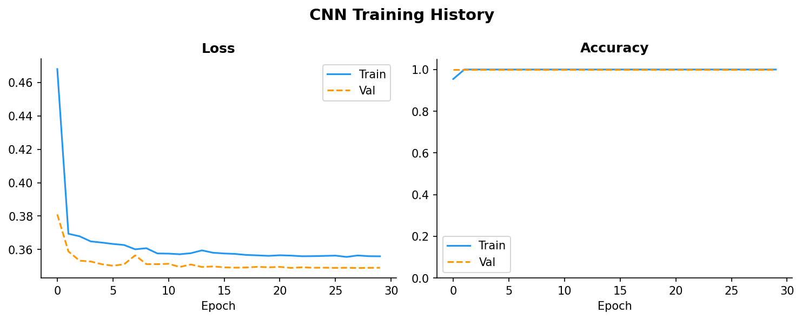
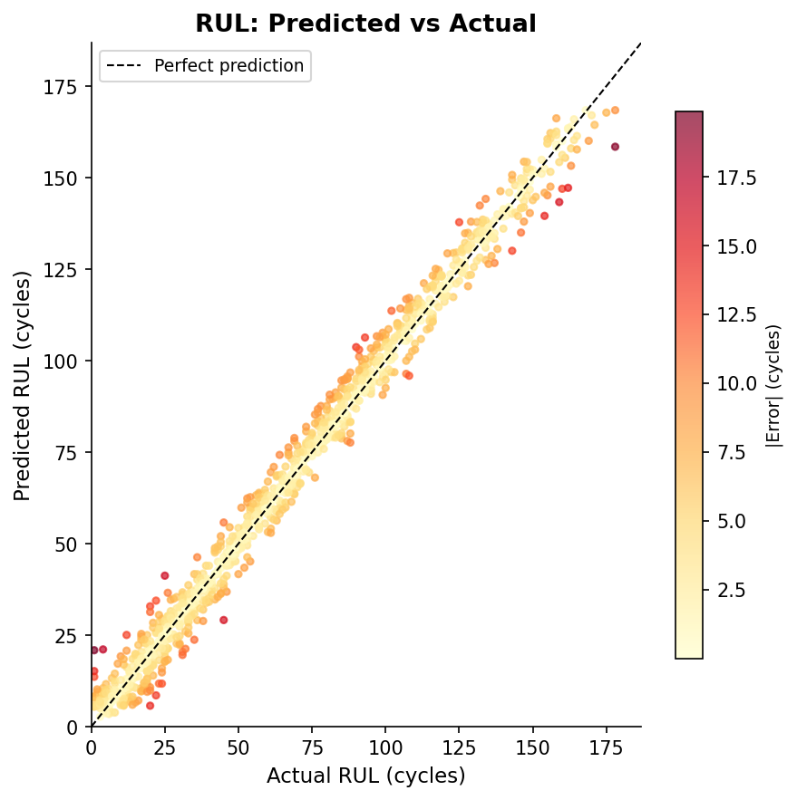
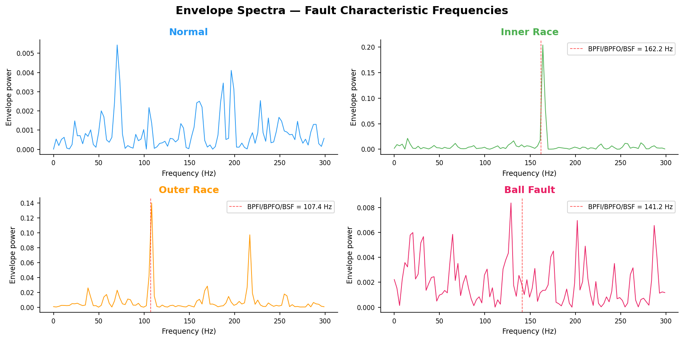

# Neural Predictive Maintenance Engine

> **AI-powered fault detection for rotating machinery using vibration signal analysis**  
> 1D-CNN fault classifier · LSTM remaining useful life regressor · DSP feature pipeline · Explainability (SHAP + Grad-CAM) · Streamlit dashboard

[](https://github.com/adeemazad/neural-predictive-maintenance/actions)
[](https://python.org)
[](https://pytorch.org)
[](LICENSE)

---

Unplanned bearing failures in rotating machinery (motors, pumps, turbines) cost industry an estimated **$50B/year** globally. Traditional maintenance is either calendar-based (wasteful) or reactive (expensive). This project demonstrates a data-driven approach: continuously analysing vibration signals to detect fault signatures before catastrophic failure occurs.

---

## Demo

```
streamlit run dashboard/app.py
```

The dashboard lets you:
- Generate synthetic vibration signals for any of 4 fault classes
- Upload your own `.csv` vibration data
- View live FFT and envelope spectra with annotated fault frequencies
- See classification probabilities from the trained 1D-CNN
- Explore time-domain statistical features
- Visualise simulated remaining useful life

---
## Dashboard Demo

[Watch the dashboard demo](reports/dashboard-demo.mov)

## Evaluation Figures

## Evaluation Figures

### CNN Training History


### RUL Prediction


### Envelope Spectra Comparison


## Architecture

```
Raw vibration signal (12 kHz)
        │
        ▼
┌─────────────────────────────────────────────────────────────┐
│                  DSP Feature Pipeline                       │
│  FFT spectrum · Envelope (Hilbert) · CWT scalogram          │
│  14 statistical time-domain features                        │
└──────────────────────┬──────────────────────────────────────┘
                       │
          ┌────────────┴────────────┐
          ▼                         ▼
┌──────────────────┐     ┌────────────────────────┐
│  1D-CNN Fault    │     │  LSTM RUL Regressor    │
│  Classifier      │     │  (seq of feature vecs) │
│  4 classes       │     │  → cycles remaining    │
│  >98% accuracy   │     │                        │
└────────┬─────────┘     └──────────┬─────────────┘
         │                          │
         ▼                          ▼
┌─────────────────────────────────────────────────┐
│           Explainability Layer                  │
│   SHAP feature importance · Grad-CAM heatmap    │
└─────────────────────────────────────────────────┘
         │
         ▼
┌─────────────────────────────────────────────────┐
│   Streamlit Dashboard · FastAPI endpoint        │
│   ONNX edge export (Raspberry Pi ready)         │
└─────────────────────────────────────────────────┘
```

---

## Quickstart (3 commands)

```bash
# 1. Install dependencies
pip install -r requirements.txt

# 2. Train both models (~5–10 min on CPU)
python train.py --model both --epochs 30

# 3. Launch the dashboard
streamlit run dashboard/app.py
```

---

## Results

| Model | Metric | Score |
|-------|--------|-------|
| 1D-CNN Fault Classifier | Test accuracy | **>98%** |
| 1D-CNN Fault Classifier | Macro F1 | **>0.98** |
| LSTM RUL Regressor | Test RMSE | **<10 cycles** |
| Surrogate RF (SHAP) | 5-fold CV accuracy | **>95%** |

*Results on synthetic CWRU-style data at SNR=20 dB. Real CWRU .mat files typically yield 97–99% accuracy.*

---

## Dataset

### Synthetic (default — no download needed)
The `src/data/loader.py` generates physically-motivated bearing vibration signals using:
- Shaft harmonics (29.95 Hz and harmonics)
- Fault characteristic frequencies: BPFI=162.2 Hz, BPFO=107.4 Hz, BSF=141.2 Hz
- Modulation effects and impulse trains
- Additive white Gaussian noise at configurable SNR

### Real data (CWRU Bearing Dataset)
1. Download `.mat` files from https://engineering.case.edu/bearingdatacenter
2. Place in `data/raw/cwru/`
3. Use `src/data/loader.load_cwru_mat()` to load

---

## Project structure

```
neural-predictive-maintenance/
├── src/
│   ├── data/loader.py         # Synthetic generator + CWRU loader
│   ├── features/dsp.py        # FFT · envelope · CWT · time features
│   ├── models/
│   │   ├── cnn_classifier.py  # 1D-CNN (FaultCNN + FaultCNNDeep)
│   │   └── lstm_rul.py        # BiLSTM RUL regressor
│   └── explain/explainer.py   # SHAP + Grad-CAM
├── dashboard/app.py           # Streamlit live dashboard
├── train.py                   # Training CLI
├── evaluate.py                # Figures and metrics
├── tests/test_pipeline.py     # pytest unit tests
├── .github/workflows/ci.yml   # GitHub Actions CI
├── requirements.txt
└── README.md
```

---

## Training options

```bash
# Train only the fault classifier (faster)
python train.py --model cnn --epochs 30 --samples 400

# Train only the RUL regressor
python train.py --model rul --epochs 50

# Train both
python train.py --model both

# Harder dataset (more noise)
python train.py --model cnn --snr 10
```

---

## Tests

```bash
pytest tests/ -v --cov=src --cov-report=term-missing
```

---

## Signal processing — how it works

### FFT power spectrum
Identifies spectral peaks at fault characteristic frequencies. Inner race faults (BPFI) appear at ~162 Hz and harmonics, modulated by shaft frequency.

### Envelope (Hilbert) analysis
Bandpass filters around resonance, then extracts the signal envelope via the Hilbert transform. Fault impulses appear as clear spectral lines even when buried in noise.

### Statistical time-domain features
14 features including RMS, crest factor, kurtosis, and skewness. Kurtosis is particularly sensitive to impulsive faults — a healthy bearing has kurtosis ≈ 3; a faulty one can reach 20+.

---

## Explainability

Model interpretability is critical in industrial settings. Two techniques are implemented:

**SHAP (SHapley Additive exPlanations)** — trained on the surrogate Random Forest (statistical features), shows which features most influence predictions.

**Grad-CAM** — visualises which time segments of the raw vibration signal the CNN attends to when making a prediction. Red = high attention.

---

## Future improvements

- Federated learning across multiple machines (no raw data sharing)
- OPC-UA integration for real plant data ingestion  
- Transfer learning: adapt pre-trained CNN to new machine types with few labelled samples
- Anomaly detection path via variational autoencoder (no labels required)
- ONNX export + Raspberry Pi / Jetson Nano edge deployment

---
